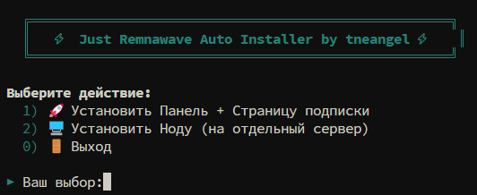

<div align="center">

# ⚡ Just Remnawave Auto Installer

### 🚀 Быстрая установка панели Remnawave в один клик

[](LICENSE)
[](https://github.com/tneange1/Just-Remnawave-Auto-Installer/releases)
[](https://www.gnu.org/software/bash/)
[](https://www.docker.com/)

[🚀 Быстрый старт](#-быстрый-старт) • [📖 Документация](#-использование) • [💬 Поддержка](#-поддержка)

</div>

---

## 📖 О проекте

**Just Remnawave Auto Installer** — это bash-скрипт с интерактивным меню для моментальной установки панели управления [Remnawave](https://github.com/remnawave). Забудьте о ручном копировании команд — скрипт сам всё скачает, настроит и запустит.

> 💡 **Идеально для YouTube-гайдов и Telegram-каналов** — все команды уже встроены в скрипт!

## ✨ Возможности

- 🎯 **Интерактивное меню** — выбирай, что устанавливать
- 🔐 **Автоматическая генерация** всех JWT-секретов и паролей БД
- 🌐 **Настройка HTTPS** через Caddy из коробки
- 📄 **Страница подписки** устанавливается вместе с панелью
- 🖥️ **Отдельная установка ноды** на другой сервер
- 🐳 **Docker** ставится автоматически, если его нет
- 🎨 **Красивый цветной вывод** с логотипом

## 📋 Требования

- 🖥️ Чистый сервер на **Ubuntu / Debian**
- 🔑 Root-доступ (sudo)
- 🌐 Домен(ы), направленные на IP сервера (A-запись)

## 🚀 Быстрый старт

Просто выполни одну команду на сервере:

```bash
sudo bash <(curl -Ls https://raw.githubusercontent.com/tneange1/Just-Remnawave-Auto-Installer/main/setup.sh)
```

Или клонируй репозиторий:

```bash
git clone https://github.com/tneange1/Just-Remnawave-Auto-Installer.git
cd Just-Remnawave-Auto-Installer
chmod +x setup.sh
sudo ./setup.sh
```

## 📖 Использование

После запуска скрипта появится меню:

```
  ╔════════════════════════════════════════════════════╗
  ║   ⚡ Just Remnawave Auto Installer by tneangel ⚡   ║
  ╚════════════════════════════════════════════════════╝

Выберите действие:
  1) 🚀 Установить Панель + Страницу подписки
  2) 🖥️  Установить Ноду (на отдельный сервер)
  0) 🚪 Выход

▶ Ваш выбор:
```

### 🎯 Опция 1 — Установка панели

Скрипт спросит:
1. **Домен панели** (например `panel.myvpn.com`)
2. **Домен страницы подписки** (например `sub.myvpn.com`)

После запуска панели скрипт попросит:
3. **API Token** — создай его в админке (`Settings → API Tokens`) и вставь в терминал

🎉 Готово! Админка и страница подписки работают по HTTPS.

### 🖥️ Опция 2 — Установка ноды

Запускай на **отдельном сервере**. Скрипт спросит:
1. **SECRET KEY** — генерируется в панели при создании ноды
2. **NODE PORT** (по умолчанию `2222`)

> ⚠️ **Важно:** После установки закрой `NODE_PORT` в фаерволе ноды для всех, кроме IP основной панели!

## 📁 Структура проекта

```
Just-Remnawave-Auto-Installer/
├── setup.sh        # Главный скрипт установщика
├── README.md       # Документация (этот файл)
└── LICENSE         # Лицензия MIT
```

## 🗺️ Что устанавливается

### На основном сервере (Опция 1):
| Компонент | Путь |
|-----------|------|
| Remnawave Panel | `/opt/remnawave/` |
| Caddy (HTTPS) | `/opt/remnawave/caddy/` |
| Subscription Page | `/opt/remnawave/subscription/` |

### На сервере ноды (Опция 2):
| Компонент | Путь |
|-----------|------|
| Remnawave Node | `/opt/remnanode/` |

## 📸 Скриншоты

<div align="center">
<table>
<tr>
<td><b>Главное меню</b></td>
<td><b>Установка панели</b></td>
</tr>
<tr>
<td></td>
<td></td>
</tr>
</table>
</div>

> 💡 Замени пути `assets/menu.png` и `assets/install.png` на свои скриншоты!

## 🎥 Гайд в YouTube Shorts

Смотри полный видео-гайд и подписывайся на Telegram-канал:

<div align="center">

[](https://youtube.com/@tneangel)
[](https://t.me/tneangel)

</div>

## 🙏 Благодарности

- 🌟 [Remnawave](https://github.com/remnawave) — за отличную панель
- 🐳 [Docker](https://www.docker.com/) — за контейнеризацию
- 🌐 [Caddy](https://caddyserver.com/) — за простой HTTPS

## 📜 Лицензия

Этот проект распространяется под лицензией **MIT**. См. файл [LICENSE](LICENSE) для подробностей.

## ⚠️ Дисклеймер

Проект предоставляется "как есть". Автор не несёт ответственности за любые повреждения или проблемы, возникшие в результате использования скрипта. Используйте на свой страх и риск.

---

<div align="center">

**⭐ Поставь звезду, если проект был полезен!**

Сделано с ❤️ by [tneangel](https://github.com/tneange1)

</div>
